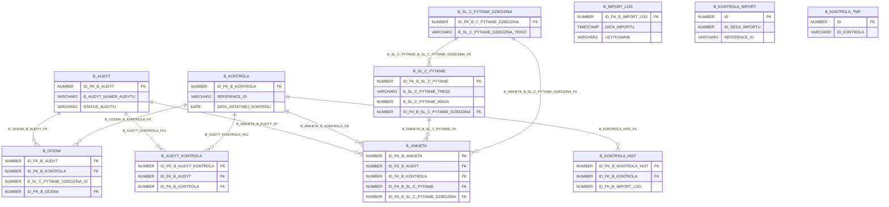

# Baza danych

## Diagram relacji



## Tabele

### Tabela: B_SL_C_PYTANIE
> Słownik pytań do zakładki C. Ocena kontroli

| Kolumna | Typ | NULL | Default | Komentarz |
|---------|-----|------|---------|-----------|
| ID_PK_B_SL_C_PYTANIE | NUMBER | NOT NULL | "DAW"."DAW_SEQ_ID_PK_B_SL_C_PYTANIE_PK"."NEXTVAL" | — |
| B_SL_C_PYTANIE_TRESC | VARCHAR2(4000 CHAR) | NULL | — | — |
| B_SL_C_PYTANIE_WAGA | NUMBER | NULL | — | — |
| B_SL_C_PYTANIE_KOLEJNOSC | NUMBER | NULL | — | — |
| B_SL_C_PYTANIE_POMOC | CLOB | NULL | — | — |
| ID_FK_B_SL_C_PYTANIE_DZIEDZINA | NUMBER(10,0) | NULL | — | — |

**Klucz główny:** B_SL_C_PYTANIE_PK (ID_PK_B_SL_C_PYTANIE)

**Foreign keys:**
- B_SL_C_PYTANIE_B_SL_C_PYTANIE_DZIEDZINA_FK: ID_FK_B_SL_C_PYTANIE_DZIEDZINA → B_SL_C_PYTANIE_DZIEDZINA(ID_PK_B_C_PYTANIE_DZIEDZINA)

**Indeksy:**
- B_SL_C_PYTANIE_PK: (ID_PK_B_SL_C_PYTANIE) (UNIQUE)

---

### Tabela: B_ANKIETA

| Kolumna | Typ | NULL | Default | Komentarz |
|---------|-----|------|---------|-----------|
| ID_PK_B_ANKIETA | NUMBER(11,0) | NULL | DAW | — |
| ID_FK_B_AUDYT | NUMBER | NULL | — | — |
| ID_FK_B_KONTROLA | NUMBER | NOT NULL | — | — |
| ID_FK_B_SL_C_PYTANIE | NUMBER | NULL | — | — |
| B_SL_C_PYTANIE_WAGA | NUMBER | NULL | — | — |
| ID_FK_B_SL_C_PYTANIE_DZIEDZINA | NUMBER(10,0) | NOT NULL | — | — |
| SHORT_DESCRIPTION_FR_ | VARCHAR2(4000) | NULL | — | — |
| REFERENCE_ID | VARCHAR2(50) | NULL | — | — |
| B_ANKIETA_ODPOWIEDZ | VARCHAR2(20) | NULL | — | — |
| B_ANKIETA_OCENA_WAZONA_LICZ | NUMBER | NULL | — | — |
| B_ANKIETA_KOMENTARZ | VARCHAR2(4000) | NULL | — | — |
| B_ANKIETA_LINK_DOKUMENTACJA | VARCHAR2(1000) | NULL | — | — |
| DATA_OSTATNIEJ_KONTROLI_NA_MOMENT_AUDYTU | DATE | NULL | — | — |

**Klucz główny:** B_ANKIETA_CON (ID_PK_B_ANKIETA)

**Foreign keys:**
- B_ANKIETA_B_AUDYT_FK: ID_FK_B_AUDYT → B_AUDYT(ID_PK_B_AUDYT)
- B_ANKIETA_B_KONTROLA_FK: ID_FK_B_KONTROLA → B_KONTROLA(ID_PK_B_KONTROLA)
- B_ANKIETA_B_SL_C_PYTANIE_FK: ID_FK_B_SL_C_PYTANIE → B_SL_C_PYTANIE(ID_PK_B_SL_C_PYTANIE)
- B_ANKIETA_B_SL_C_PYTANIE_DZIEDZINA_FK: ID_FK_B_SL_C_PYTANIE_DZIEDZINA → B_SL_C_PYTANIE_DZIEDZINA(ID_PK_B_C_PYTANIE_DZIEDZINA)

**Indeksy:**
- B_ANKIETA_CON: (ID_PK_B_ANKIETA) (UNIQUE)

---

### Tabela: B_AUDYT
> Tabela audytow. Cykl zycia statusu: Otwarty -> Zamrozony -> Zakonczony.

| Kolumna | Typ | NULL | Default | Komentarz |
|---------|-----|------|---------|-----------|
| ID_PK_B_AUDYT | NUMBER (IDENTITY) | NOT NULL | — | — |
| B_AUDYT_NUMER_AUDYTU | VARCHAR2(40 CHAR) | NULL | — | — |
| STATUS_AUDYTU | VARCHAR2(20) | NOT NULL | 'Otwarty' | Status audytu: Otwarty=edycja mozliwa, Zamrozony=brak zmian listy kontroli, Zakonczony=brak jakichkolwiek zmian |
| SZEF_MISJI_LOGIN | VARCHAR2(100) | NULL | — | Login LDAP (APP_USER) szefa misji – zapisywany przy tworzeniu rekordu, tylko on moze zamrozic/zakonczyc audyt |
| AUDYTORZY_LOGINY | VARCHAR2(4000) | NULL | — | Loginy LDAP audytorow uprawnionych do edycji, oddzielone przecinkiem (np. JAN.KOWALSKI,ANNA.NOWAK) |
| DATA_UTWORZENIA | DATE | NULL | SYSDATE | — |
| DATA_ZAMROZENIA | DATE | NULL | — | Data zamrozenia listy kontroli przez szefa misji |
| DATA_ZAKONCZENIA | DATE | NULL | — | Data zakonczenia audytu przez szefa misji (brak dalszych zmian) |
| ZAMROZIL_LOGIN | VARCHAR2(100) | NULL | — | — |
| ZAKONCZYL_LOGIN | VARCHAR2(100) | NULL | — | — |

**Klucz główny:** B_AUDYT_PK (ID_PK_B_AUDYT)

**Check constraints:**
- B_AUDYT_STATUS_CHK: `STATUS_AUDYTU IN ('Otwarty', 'Zamrozony', 'Zakonczony')`

**Indeksy:**
- B_AUDYT_PK: (ID_PK_B_AUDYT) (UNIQUE)

---

### Tabela: B_AUDYT_KONTROLA
> Lista kontroli przypisanych do audytu. INSERT/DELETE mozliwy tylko gdy STATUS_AUDYTU=Otwarty (wymuszane przez PKG_AUDYT).

| Kolumna | Typ | NULL | Default | Komentarz |
|---------|-----|------|---------|-----------|
| ID_PK_B_AUDYT_KONTROLA | NUMBER (IDENTITY) | NOT NULL | — | — |
| ID_FK_B_AUDYT | NUMBER | NOT NULL | — | — |
| ID_FK_B_KONTROLA | NUMBER | NOT NULL | — | — |
| DODAL_LOGIN | VARCHAR2(100) | NOT NULL | — | Login LDAP uzytkownika, ktory dodal kontrole do audytu |
| DATA_DODANIA | DATE | NOT NULL | SYSDATE | — |
| CZY_ANKIETA_WYGENEROWANA | NUMBER | NULL | 0 | Flaga: 0=ankieta nie wygenerowana, 1=rekordy B_ANKIETA i B_OCENA istnieja |

**Klucz główny:** B_AUDYT_KONTROLA_PK (ID_PK_B_AUDYT_KONTROLA)

**Foreign keys:**
- B_AUDYT_KONTROLA_FK1: ID_FK_B_AUDYT → B_AUDYT(ID_PK_B_AUDYT)
- B_AUDYT_KONTROLA_FK2: ID_FK_B_KONTROLA → B_KONTROLA(ID_PK_B_KONTROLA)

**Unique constraints:**
- B_AUDYT_KONTROLA_UNQ: (ID_FK_B_AUDYT, ID_FK_B_KONTROLA)

**Indeksy:**
- B_AUDYT_KONTROLA_IDX1: (ID_FK_B_AUDYT)
- B_AUDYT_KONTROLA_IDX2: (ID_FK_B_KONTROLA)
- B_AUDYT_KONTROLA_PK: (ID_PK_B_AUDYT_KONTROLA) (UNIQUE)
- B_AUDYT_KONTROLA_UNQ: (ID_FK_B_AUDYT, ID_FK_B_KONTROLA) (UNIQUE)

---

### Tabela: B_IMPORT_LOG
> Log kazdego uruchomienia importu kontroli z Excela. Jeden rekord = jeden import.

| Kolumna | Typ | NULL | Default | Komentarz |
|---------|-----|------|---------|-----------|
| ID_PK_B_IMPORT_LOG | NUMBER (IDENTITY) | NOT NULL | — | — |
| DATA_IMPORTU | TIMESTAMP (6) | NOT NULL | SYSTIMESTAMP | — |
| UZYTKOWNIK | VARCHAR2(100) | NOT NULL | — | Login LDAP uzytkownika APEX (APP_USER), ktory uruchomil import |
| NAZWA_PLIKU | VARCHAR2(500) | NULL | — | — |
| LICZBA_WCZYTANYCH | NUMBER | NULL | 0 | — |
| LICZBA_DODANYCH | NUMBER | NULL | 0 | — |
| LICZBA_ZMODYFIKOWANYCH | NUMBER | NULL | 0 | — |
| LICZBA_DEZAKTYWOWANYCH | NUMBER | NULL | 0 | — |
| LICZBA_BEZ_ZMIAN | NUMBER | NULL | 0 | — |
| LICZBA_BLEDOW | NUMBER | NULL | 0 | — |
| STATUS_IMPORTU | VARCHAR2(20) | NULL | 'W_TOKU' | W_TOKU=import trwa, ZAKONCZONE=sukces, BLAD_KRYTYCZNY=nieobsluzony wyjatek |
| KOMUNIKAT_BLEDU | VARCHAR2(4000) | NULL | — | — |

**Klucz główny:** B_IMPORT_LOG_PK (ID_PK_B_IMPORT_LOG)

**Indeksy:**
- B_IMPORT_LOG_PK: (ID_PK_B_IMPORT_LOG) (UNIQUE)

---

### Tabela: B_KONTROLA
> WITH kontrole AS (
SELECT
	a.REFERENCE AS REFERENCE_id,
	max(a.AS_OF_DATE) AS data_ostatniej_kontroli,
	min(a.AS_OF_DATE) AS data_pierwszej_kontroli,
	count(1) AS liczba_wykonanych_kontroli
FROM
	ZKW_GRP.SCOPE_DEFINITION_2024 a
GROUP BY
	a.REFERENCE)
SELECT
	DISTINCT aa.*,
b.STATUS,
b.CONTROL_LEVEL ,
b.DESCRIPTION____FR_ ,
b.DESCRIPTION____EN_ ,
b.SHORT_DESCRIPTION____FR_,
b.SHORT_DESCRIPTION____EN_,
b.DEFINITION____FR_,
b.DEFINITION____EN_,
b.OBJECTIVE____FR_,
b.OBJECTIVE____EN_,
b.DOMAIN_PROCESS,
b.RISKS,
b.CONTROL_GROUP
FROM
	kontrole aa
JOIN ZKW_GRP.SCOPE_DEFINITION_2024 b ON
	aa.REFERENCE_id = b.REFERENCE
	AND aa.data_ostatniej_kontroli = b.AS_OF_DATE

| Kolumna | Typ | NULL | Default | Komentarz |
|---------|-----|------|---------|-----------|
| ID_PK_B_KONTROLA | NUMBER (IDENTITY) | NOT NULL | — | — |
| REFERENCE_ID | VARCHAR2(50) | NULL | — | — |
| DATA_OSTATNIEJ_KONTROLI | DATE | NULL | — | — |
| DATA_PIERWSZEJ_KONTROLI | DATE | NULL | — | — |
| LICZBA_WYKONANYCH_KONTROLI | NUMBER | NULL | — | — |
| STATUS | VARCHAR2(50) | NULL | — | — |
| CONTROL_LEVEL | VARCHAR2(50) | NULL | — | — |
| DESCRIPTION_FR_ | VARCHAR2(4000) | NULL | — | — |
| DESCRIPTION_EN_ | VARCHAR2(4000) | NULL | — | — |
| SHORT_DESCRIPTION_FR_ | VARCHAR2(4000) | NULL | — | — |
| SHORT_DESCRIPTION_EN_ | VARCHAR2(4000) | NULL | — | — |
| DEFINITION_FR_ | VARCHAR2(4000) | NULL | — | — |
| DEFINITION_EN_ | VARCHAR2(4000) | NULL | — | — |
| OBJECTIVE_FR_ | VARCHAR2(4000) | NULL | — | — |
| OBJECTIVE_EN_ | VARCHAR2(4000) | NULL | — | — |
| DOMAIN_PROCESS | VARCHAR2(255) | NULL | — | — |
| RISKS | VARCHAR2(4000) | NULL | — | — |
| CONTROL_GROUP | VARCHAR2(255) | NULL | — | — |
| DATA_DEZAKTYWACJI | DATE | NULL | — | Data ustawienia STATUS=Deactive (brak rekordu w pliku importu). NULL gdy aktywny. |
| ID_FK_B_IMPORT_LOG | NUMBER | NULL | — | Ostatni import, ktory modyfikowal ten rekord (FK do B_IMPORT_LOG) |

**Klucz główny:**  (ID_PK_B_KONTROLA)

**Indeksy:**
- SYS_C0052791: (ID_PK_B_KONTROLA) (UNIQUE)

---

### Tabela: B_KONTROLA_HIST
> Historia zmian tabeli B_KONTROLA. Kazda aktualizacja importem zapisuje tu poprzednia wersje rekordu.

| Kolumna | Typ | NULL | Default | Komentarz |
|---------|-----|------|---------|-----------|
| ID_PK_B_KONTROLA_HIST | NUMBER (IDENTITY) | NOT NULL | — | — |
| ID_FK_B_KONTROLA | NUMBER | NOT NULL | — | Klucz obcy do B_KONTROLA – nie zmienia sie przy aktualizacjach |
| ID_FK_B_IMPORT_LOG | NUMBER | NOT NULL | — | Import, ktory spowodowal zmiane |
| DATA_ARCHIWIZACJI | TIMESTAMP (6) | NOT NULL | SYSTIMESTAMP | Kiedy stara wersja zostala zarchiwizowana (= moment importu) |
| UZYTKOWNIK_ZMIANY | VARCHAR2(100) | NOT NULL | — | — |
| REFERENCE_ID | VARCHAR2(50) | NULL | — | — |
| STATUS | VARCHAR2(50) | NULL | — | — |
| CONTROL_LEVEL | VARCHAR2(50) | NULL | — | — |
| DESCRIPTION_FR_ | VARCHAR2(4000) | NULL | — | — |
| DESCRIPTION_EN_ | VARCHAR2(4000) | NULL | — | — |
| SHORT_DESCRIPTION_FR_ | VARCHAR2(4000) | NULL | — | — |
| SHORT_DESCRIPTION_EN_ | VARCHAR2(4000) | NULL | — | — |
| DEFINITION_FR_ | VARCHAR2(4000) | NULL | — | — |
| DEFINITION_EN_ | VARCHAR2(4000) | NULL | — | — |
| OBJECTIVE_FR_ | VARCHAR2(4000) | NULL | — | — |
| OBJECTIVE_EN_ | VARCHAR2(4000) | NULL | — | — |
| DOMAIN_PROCESS | VARCHAR2(255) | NULL | — | — |
| RISKS | VARCHAR2(4000) | NULL | — | — |
| CONTROL_GROUP | VARCHAR2(255) | NULL | — | — |

**Klucz główny:** B_KONTROLA_HIST_PK (ID_PK_B_KONTROLA_HIST)

**Foreign keys:**
- B_KONTROLA_HIST_FK: ID_FK_B_KONTROLA → B_KONTROLA(ID_PK_B_KONTROLA)

**Indeksy:**
- B_KONTROLA_HIST_IDX1: (ID_FK_B_KONTROLA)
- B_KONTROLA_HIST_IDX2: (ID_FK_B_IMPORT_LOG)
- B_KONTROLA_HIST_PK: (ID_PK_B_KONTROLA_HIST) (UNIQUE)

---

### Tabela: B_KONTROLA_IMPORT
> Tabela stagingowa do importu kontroli z pliku Excel przez APEX. Czyszczona po kazdym zakonczonym imporcie.

| Kolumna | Typ | NULL | Default | Komentarz |
|---------|-----|------|---------|-----------|
| ID | NUMBER (IDENTITY) | NOT NULL | — | — |
| ID_SESJI_IMPORTU | NUMBER | NOT NULL | — | Laczy wiersze z konkretna sesja importu (B_IMPORT_LOG.ID_PK_B_IMPORT_LOG) |
| REFERENCE_ID | VARCHAR2(50) | NULL | — | — |
| STATUS | VARCHAR2(50) | NULL | — | — |
| CONTROL_LEVEL | VARCHAR2(50) | NULL | — | — |
| DESCRIPTION_FR_ | VARCHAR2(4000) | NULL | — | — |
| DESCRIPTION_EN_ | VARCHAR2(4000) | NULL | — | — |
| SHORT_DESCRIPTION_FR_ | VARCHAR2(4000) | NULL | — | — |
| SHORT_DESCRIPTION_EN_ | VARCHAR2(4000) | NULL | — | — |
| DEFINITION_FR_ | VARCHAR2(4000) | NULL | — | — |
| DEFINITION_EN_ | VARCHAR2(4000) | NULL | — | — |
| OBJECTIVE_FR_ | VARCHAR2(4000) | NULL | — | — |
| OBJECTIVE_EN_ | VARCHAR2(4000) | NULL | — | — |
| DOMAIN_PROCESS | VARCHAR2(255) | NULL | — | — |
| RISKS | VARCHAR2(4000) | NULL | — | — |
| CONTROL_GROUP | VARCHAR2(255) | NULL | — | — |
| BLAD_WALIDACJI | VARCHAR2(4000) | NULL | — | — |
| STATUS_WIERSZA | VARCHAR2(20) | NULL | 'NOWY' | NOWY=oczekuje na przetworzenie, OK=przetworzony, BLAD=blad walidacji |

**Klucz główny:** B_KONTROLA_IMPORT_PK (ID)

**Indeksy:**
- B_KONTROLA_IMPORT_IDX1: (ID_SESJI_IMPORTU, STATUS_WIERSZA)
- B_KONTROLA_IMPORT_PK: (ID) (UNIQUE)

---

### Tabela: B_KONTROLA_TMP
> tabela tymczasowa z ID kontroli w audycie IT - tabela do skasowania w przyszłości

| Kolumna | Typ | NULL | Default | Komentarz |
|---------|-----|------|---------|-----------|
| ID | NUMBER (IDENTITY) | NOT NULL | — | — |
| ID_KONTROLA | VARCHAR2(50) | NULL | — | — |

**Klucz główny:**  (ID)

**Indeksy:**
- SYS_C0052793: (ID) (UNIQUE)

---

### Tabela: B_OCENA
> CREATE TABLE B_ODPOWIEDZ AS 	
SELECT
	DISTINCT 
	ID_FK_B_AUDYT,
	ID_FK_B_KONTROLA,
	B_SL_C_PYTANIE_DZIEDZINA_ID
FROM
	B_ANKIETA

| Kolumna | Typ | NULL | Default | Komentarz |
|---------|-----|------|---------|-----------|
| ID_FK_B_AUDYT | NUMBER | NOT NULL | — | — |
| ID_FK_B_KONTROLA | NUMBER | NOT NULL | — | — |
| B_SL_C_PYTANIE_DZIEDZINA_ID | NUMBER(38,0) | NOT NULL | — | — |
| ID_PK_B_OCENA | NUMBER(38,0) | NOT NULL | DAW | — |
| B_OCENA_LICZONA | NUMBER(15,2) | NULL | — | — |
| B_OCENA_NADPISANA | NUMBER | NULL | — | — |
| B_OCENA_CZY_NADPISANA | NUMBER | NULL | 0 | — |
| B_OCENA_PRZELAMANA_UZASADNIENIE | VARCHAR2(4000) | NULL | — | — |

**Klucz główny:** B_ODPOWIEDZ_PK (ID_PK_B_OCENA)

**Foreign keys:**
- B_OCENA_B_AUDYT_FK: ID_FK_B_AUDYT → B_AUDYT(ID_PK_B_AUDYT)
- B_OCENA_B_KONTROLA_FK: ID_FK_B_KONTROLA → B_KONTROLA(ID_PK_B_KONTROLA)

**Indeksy:**
- B_ODPOWIEDZ_PK: (ID_PK_B_OCENA) (UNIQUE)

---

### Tabela: B_SL_C_PYTANIE_DZIEDZINA

| Kolumna | Typ | NULL | Default | Komentarz |
|---------|-----|------|---------|-----------|
| ID_PK_B_C_PYTANIE_DZIEDZINA | NUMBER(7,0) | NULL | "DAW"."DAW_SEQ_B_SL_C_PYTANIE_DZIEDZINA_PK"."NEXTVAL" | — |
| B_SL_C_PYTANIE_DZIEDZINA_TEKST | VARCHAR2(100) | NULL | — | — |

**Klucz główny:** B_SL_C_PYTANIE_DZIEDZINA_PK (ID_PK_B_C_PYTANIE_DZIEDZINA)

**Indeksy:**
- B_SL_C_PYTANIE_DZIEDZINA_PK: (ID_PK_B_C_PYTANIE_DZIEDZINA) (UNIQUE)

---

## Widoki

### Widok: B_V_AUDYT_KONTROLE
> Widok: kontrole przypisane do audytow z pelnymi danymi. Zrodlo danych dla stron APEX audytu.
**Kolumny:** ID_PK_B_AUDYT_KONTROLA, ID_FK_B_AUDYT, ID_FK_B_KONTROLA, DODAL_LOGIN, DATA_DODANIA, REFERENCE_ID, STATUS_KONTROLI, CONTROL_LEVEL, SHORT_DESCRIPTION_FR_, SHORT_DESCRIPTION_EN_, DESCRIPTION_FR_, DESCRIPTION_EN_, DOMAIN_PROCESS, CONTROL_GROUP, RISKS, B_AUDYT_NUMER_AUDYTU, STATUS_AUDYTU, SZEF_MISJI_LOGIN, AUDYTORZY_LOGINY

```sql
SELECT
    ak.ID_PK_B_AUDYT_KONTROLA,
    ak.ID_FK_B_AUDYT,
    ak.ID_FK_B_KONTROLA,
    ak.DODAL_LOGIN,
    ak.DATA_DODANIA,
    k.REFERENCE_ID,
    k.STATUS                AS STATUS_KONTROLI,
    k.CONTROL_LEVEL,
    k.SHORT_DESCRIPTION_FR_,
    k.SHORT_DESCRIPTION_EN_,
    k.DESCRIPTION_FR_,
    k.DESCRIPTION_EN_,
    k.DOMAIN_PROCESS,
    k.CONTROL_GROUP,
    k.RISKS,
    a.B_AUDYT_NUMER_AUDYTU,
    a.STATUS_AUDYTU,
    a.SZEF_MISJI_LOGIN,
    a.AUDYTORZY_LOGINY
FROM
    B_AUDYT_KONTROLA    ak
    JOIN B_KONTROLA     k  ON k.ID_PK_B_KONTROLA = ak.ID_FK_B_KONTROLA
    JOIN B_AUDYT        a  ON a.ID_PK_B_AUDYT     = ak.ID_FK_B_AUDYT
```

---

### Widok: B_V_IMPORT_STATYSTYKI
> Widok: historia importow kontroli z podsumowaniem statystyk. Zrodlo danych dla strony logow importu w APEX.
**Kolumny:** ID_PK_B_IMPORT_LOG, DATA_IMPORTU, UZYTKOWNIK, NAZWA_PLIKU, LICZBA_WCZYTANYCH, LICZBA_DODANYCH, LICZBA_ZMODYFIKOWANYCH, LICZBA_DEZAKTYWOWANYCH, LICZBA_BEZ_ZMIAN, LICZBA_BLEDOW, STATUS_IMPORTU, KOMUNIKAT_BLEDU, PODSUMOWANIE

```sql
SELECT
    il.ID_PK_B_IMPORT_LOG,
    il.DATA_IMPORTU,
    il.UZYTKOWNIK,
    il.NAZWA_PLIKU,
    il.LICZBA_WCZYTANYCH,
    il.LICZBA_DODANYCH,
    il.LICZBA_ZMODYFIKOWANYCH,
    il.LICZBA_DEZAKTYWOWANYCH,
    il.LICZBA_BEZ_ZMIAN,
    il.LICZBA_BLEDOW,
    il.STATUS_IMPORTU,
    il.KOMUNIKAT_BLEDU,
    -- Pole tekstowe do wyswietlenia skroconego podsumowania w APEX
    'Dodane: '        || il.LICZBA_DODANYCH         || ' | ' ||
    'Zmodyfikowane: ' || il.LICZBA_ZMODYFIKOWANYCH  || ' | ' ||
    'Dezaktywowane: ' || il.LICZBA_DEZAKTYWOWANYCH  || ' | ' ||
    'Bledy: '         || il.LICZBA_BLEDOW            AS PODSUMOWANIE
FROM
    B_IMPORT_LOG il
ORDER BY
    il.DATA_IMPORTU DESC
```

---

## Pakiety PL/SQL

### Pakiet: PKG_ANKIETA

#### Specyfikacja

| Procedura/Funkcja | Parametry | Zwraca | Opis |
|-------------------|-----------|--------|------|
| GENERUJ_ANKIETE | p_id_audytu IN NUMBER, p_id_kontrola IN NUMBER | — | Generuje ankiete (B_ANKIETA) i oceny (B_OCENA) dla pary audyt+kontrola. Idempotentna – jesli flaga CZY_ANKIETA_WYGENEROWANA = 1, nie robi nic. Wykonuje COMMIT na koncu (po wzorcu z PKG_AUDYT). |
| USUN_ANKIETE | p_id_audytu IN NUMBER, p_id_kontrola IN NUMBER | — | Usuwa ankiete (B_ANKIETA) i oceny (B_OCENA) dla pary audyt+kontrola. NIE wykonuje COMMIT – wywolujacy odpowiada za transakcje (typowo: PKG_AUDYT.USUN_KONTROLE zrobi COMMIT po usunieciu z B_AUDYT_KONTROLA). |

#### Implementacja (body)

```plsql
create or replace PACKAGE BODY PKG_ANKIETA AS
    -- =========================================================================
    -- PROCEDURA: GENERUJ_ANKIETE
    -- 
    -- Logika:
    --   1. Sprawdz flage CZY_ANKIETA_WYGENEROWANA w B_AUDYT_KONTROLA
    --   2. Jesli flaga = 1 → zakoncz (ankieta juz istnieje)
    --   3. Pobierz dane kontroli (REFERENCE_ID, SHORT_DESCRIPTION_FR_)
    --   4. Wstaw rekordy do B_ANKIETA – jeden na kazde pytanie ze slownika
    --   5. Wstaw rekordy do B_OCENA – jeden na kazda dziedzine
    --   6. Ustaw flage = 1
    --   7. COMMIT
    -- =========================================================================
    PROCEDURE GENERUJ_ANKIETE (
        p_id_audytu     IN NUMBER,
        p_id_kontrola   IN NUMBER
    ) IS
        v_flaga         NUMBER;
        v_ref_id        B_KONTROLA.REFERENCE_ID%TYPE;
        v_short_desc    B_KONTROLA.SHORT_DESCRIPTION_FR_%TYPE;
        v_liczba_pytan  NUMBER;
        v_liczba_ocen   NUMBER;
    BEGIN
        -- ----------------------------------------------------------------
        -- Krok 1: Sprawdz czy ankieta juz wygenerowana
        -- ----------------------------------------------------------------
        BEGIN
            SELECT NVL(CZY_ANKIETA_WYGENEROWANA, 0)
            INTO   v_flaga
            FROM   B_AUDYT_KONTROLA
            WHERE  ID_FK_B_AUDYT    = p_id_audytu
              AND  ID_FK_B_KONTROLA = p_id_kontrola;
        EXCEPTION
            WHEN NO_DATA_FOUND THEN
                RAISE_APPLICATION_ERROR(-20050,
                    'Kontrola ID=' || p_id_kontrola || 
                    ' nie jest przypisana do audytu ID=' || p_id_audytu || '.');
        END;
        -- Krok 2: Jesli ankieta juz istnieje – nic nie robimy
        IF v_flaga = 1 THEN
            RETURN;
        END IF;
        -- ----------------------------------------------------------------
        -- Krok 3: Pobierz dane kontroli potrzebne do B_ANKIETA
        -- ----------------------------------------------------------------
        BEGIN
            SELECT REFERENCE_ID, SHORT_DESCRIPTION_FR_
            INTO   v_ref_id, v_short_desc
            FROM   B_KONTROLA
            WHERE  ID_PK_B_KONTROLA = p_id_kontrola;
        EXCEPTION
            WHEN NO_DATA_FOUND THEN
                RAISE_APPLICATION_ERROR(-20051,
                    'Kontrola ID=' || p_id_kontrola || ' nie istnieje w B_KONTROLA.');
        END;
        -- ----------------------------------------------------------------
        -- Krok 4: Wygeneruj rekordy ankiety – jeden wiersz na kazde pytanie
        -- Zabezpieczenie NOT EXISTS chroni przed duplikatami
        -- (np. przy ponownym wywolaniu po czesciowej awarii)
        -- ----------------------------------------------------------------
        INSERT INTO B_ANKIETA (
            ID_FK_B_AUDYT,
            ID_FK_B_KONTROLA,
            ID_FK_B_SL_C_PYTANIE,
            B_SL_C_PYTANIE_WAGA,
            ID_FK_B_SL_C_PYTANIE_DZIEDZINA,
            SHORT_DESCRIPTION_FR_,
            REFERENCE_ID
        )
        SELECT
            p_id_audytu,
            p_id_kontrola,
            p.ID_PK_B_SL_C_PYTANIE,
            p.B_SL_C_PYTANIE_WAGA,
            p.ID_FK_B_SL_C_PYTANIE_DZIEDZINA,
            v_short_desc,
            v_ref_id
        FROM
            B_SL_C_PYTANIE p
        WHERE NOT EXISTS (
            SELECT 1 FROM B_ANKIETA a
            WHERE  a.ID_FK_B_AUDYT        = p_id_audytu
              AND  a.ID_FK_B_KONTROLA     = p_id_kontrola
              AND  a.ID_FK_B_SL_C_PYTANIE = p.ID_PK_B_SL_C_PYTANIE
        );
        v_liczba_pytan := SQL%ROWCOUNT;
        -- ----------------------------------------------------------------
        -- Krok 5: Wygeneruj rekordy ocen – jeden na kazda dziedzine
        -- (typowo 2: Adekwatnosc=1, Skutecznosc=2)
        -- ----------------------------------------------------------------
        INSERT INTO B_OCENA (
            ID_FK_B_AUDYT,
            ID_FK_B_KONTROLA,
            B_SL_C_PYTANIE_DZIEDZINA_ID,
            B_OCENA_CZY_NADPISANA
        )
        SELECT
            p_id_audytu,
            p_id_kontrola,
            d.ID_PK_B_C_PYTANIE_DZIEDZINA,
            0  -- domyslnie: ocena NIE jest nadpisana
        FROM
            B_SL_C_PYTANIE_DZIEDZINA d
        WHERE NOT EXISTS (
            SELECT 1 FROM B_OCENA o
            WHERE  o.ID_FK_B_AUDYT               = p_id_audytu
              AND  o.ID_FK_B_KONTROLA            = p_id_kontrola
              AND  o.B_SL_C_PYTANIE_DZIEDZINA_ID = d.ID_PK_B_C_PYTANIE_DZIEDZINA
        );
        v_liczba_ocen := SQL%ROWCOUNT;
        -- ----------------------------------------------------------------
        -- Krok 6: Ustaw flage w B_AUDYT_KONTROLA
        -- ----------------------------------------------------------------
        UPDATE B_AUDYT_KONTROLA
        SET    CZY_ANKIETA_WYGENEROWANA = 1
        WHERE  ID_FK_B_AUDYT    = p_id_audytu
          AND  ID_FK_B_KONTROLA = p_id_kontrola;
        -- ----------------------------------------------------------------
        -- Krok 7: COMMIT (zgodnie z wzorcem z PKG_AUDYT)
        -- ----------------------------------------------------------------
        COMMIT;
    END GENERUJ_ANKIETE;
    -- =========================================================================
    -- PROCEDURA: USUN_ANKIETE
    --
    -- Kolejnosc: najpierw B_OCENA, potem B_ANKIETA.
    -- NIE wykonuje COMMIT – PKG_AUDYT.USUN_KONTROLE (wywolywana zaraz potem)
    -- zrobi COMMIT po usunieciu rekordu z B_AUDYT_KONTROLA.
    -- Dzieki temu jesli USUN_KONTROLE rzuci wyjatek (np. zly status audytu),
    -- cala operacja (lacznie z usunieciem ankiety) zostanie wycofana.
    -- =========================================================================
    PROCEDURE USUN_ANKIETE (
        p_id_audytu     IN NUMBER,
        p_id_kontrola   IN NUMBER
    ) IS
    BEGIN
        -- Usun oceny dla pary audyt+kontrola
        DELETE FROM B_OCENA
        WHERE  ID_FK_B_AUDYT    = p_id_audytu
          AND  ID_FK_B_KONTROLA = p_id_kontrola;
        -- Usun rekordy ankiety dla pary audyt+kontrola
        DELETE FROM B_ANKIETA
        WHERE  ID_FK_B_AUDYT    = p_id_audytu
          AND  ID_FK_B_KONTROLA = p_id_kontrola;
        -- Flaga CZY_ANKIETA_WYGENEROWANA nie wymaga resetu,
        -- poniewaz caly rekord B_AUDYT_KONTROLA zostanie usuniety
        -- przez PKG_AUDYT.USUN_KONTROLE wywolana zaraz po tej procedurze.
    END USUN_ANKIETE;
END PKG_ANKIETA;
```

---

### Pakiet: PKG_AUDYT

**Stałe:**
- `C_STATUS_OTWARTY    CONSTANT VARCHAR2(20) := 'Otwarty'`
- `C_STATUS_ZAMROZONY  CONSTANT VARCHAR2(20) := 'Zamrozony'`
- `C_STATUS_ZAKONCZONY CONSTANT VARCHAR2(20) := 'Zakonczony'`

#### Specyfikacja

| Procedura/Funkcja | Parametry | Zwraca | Opis |
|-------------------|-----------|--------|------|
| UTWORZ_AUDYT | p_numer_audytu IN VARCHAR2, p_uzytkownik IN VARCHAR2, p_id_audytu OUT NUMBER | — | Tworzenie nowego audytu p_uzytkownik automatycznie staje sie szefem misji |
| DODAJ_KONTROLE | p_id_audytu IN NUMBER, p_id_kontrola IN NUMBER, p_uzytkownik IN VARCHAR2 | — | Dodanie kontroli do listy audytu (tylko STATUS=Otwarty, szef lub audytor) |
| USUN_KONTROLE | p_id_audytu IN NUMBER, p_id_kontrola IN NUMBER, p_uzytkownik IN VARCHAR2 | — | Usuniecie kontroli z listy audytu (tylko STATUS=Otwarty, szef lub audytor) |
| ZAMROZ_AUDYT | p_id_audytu IN NUMBER, p_uzytkownik IN VARCHAR2 | — | Zamrozenie audytu – blokuje dodawanie/usuwanie kontroli (tylko szef misji) |
| ZAKONCZ_AUDYT | p_id_audytu IN NUMBER, p_uzytkownik IN VARCHAR2 | — | Zakonczenie audytu – blokuje wszelkie zmiany (tylko szef misji) |
| SPRAWDZ_UPRAWNIENIA | p_id_audytu IN NUMBER, p_uzytkownik IN VARCHAR2 | VARCHAR2 | Sprawdza role uzytkownika: zwraca 'SZEF' / 'AUDYTOR' / 'BRAK' |
| MOZE_EDYTOWAC | p_id_audytu IN NUMBER, p_uzytkownik IN VARCHAR2 | BOOLEAN | Czy uzytkownik moze edytowac dane audytu? (szef lub audytor + nie Zakonczony) |

#### Procedury prywatne (body)

- **POBIERZ_AUDYT**(p_id_audytu IN NUMBER, v_audyt OUT B_AUDYT) — Procedura wewnetrzna: pobierz rekord audytu lub rzuc wyjatek

#### Implementacja (body)

```plsql
create or replace PACKAGE BODY PKG_AUDYT AS 
 
    -- ========================================================================= 
    -- Procedura wewnetrzna: pobierz rekord audytu lub rzuc wyjatek 
    -- ========================================================================= 
    PROCEDURE POBIERZ_AUDYT ( 
        p_id_audytu IN  NUMBER, 
        v_audyt     OUT B_AUDYT%ROWTYPE 
    ) IS 
    BEGIN 
        SELECT * INTO v_audyt 
        FROM   B_AUDYT 
        WHERE  ID_PK_B_AUDYT = p_id_audytu; 
    EXCEPTION 
        WHEN NO_DATA_FOUND THEN 
            RAISE_APPLICATION_ERROR(-20001, 
                'Audyt o ID=' || p_id_audytu || ' nie istnieje.'); 
    END POBIERZ_AUDYT; 
 
 
    -- ========================================================================= 
    -- FUNKCJA: SPRAWDZ_UPRAWNIENIA 
    -- Zwraca role uzytkownika w kontekscie danego audytu. 
    -- Porownanie case-insensitive (LDAP moze zwracac rozny case). 
    -- ========================================================================= 
    FUNCTION SPRAWDZ_UPRAWNIENIA ( 
        p_id_audytu     IN NUMBER, 
        p_uzytkownik    IN VARCHAR2 
    ) RETURN VARCHAR2 IS 
        v_audyt     B_AUDYT%ROWTYPE; 
        v_login_uc  VARCHAR2(100); 
    BEGIN 
        POBIERZ_AUDYT(p_id_audytu, v_audyt); 
        v_login_uc := UPPER(TRIM(p_uzytkownik)); 
 
        -- Sprawdz czy to szef misji 
        IF UPPER(TRIM(v_audyt.SZEF_MISJI_LOGIN)) = v_login_uc THEN 
            RETURN 'SZEF'; 
        END IF; 
 
        -- Sprawdz czy login jest na liscie audytorow (separator: przecinek) 
        -- Technika: otaczamy caly ciag i szukany login przecinkami 
        IF v_audyt.AUDYTORZY_LOGINY IS NOT NULL THEN 
            IF INSTR(',' || UPPER(v_audyt.AUDYTORZY_LOGINY) || ',', 
                     ',' || v_login_uc || ',') > 0 THEN 
                RETURN 'AUDYTOR'; 
            END IF; 
        END IF; 
 
        RETURN 'BRAK'; 
    END SPRAWDZ_UPRAWNIENIA; 
 
 
    -- ========================================================================= 
    -- FUNKCJA: MOZE_EDYTOWAC 
    -- Czy uzytkownik moze edytowac dane (ankiete, odpowiedzi) w audycie? 
    -- Warunek: (SZEF lub AUDYTOR) ORAZ audyt nie jest Zakonczony. 
    -- ========================================================================= 
    FUNCTION MOZE_EDYTOWAC ( 
        p_id_audytu     IN NUMBER, 
        p_uzytkownik    IN VARCHAR2 
    ) RETURN BOOLEAN IS 
        v_audyt         B_AUDYT%ROWTYPE; 
        v_uprawnienia   VARCHAR2(20); 
    BEGIN 
        POBIERZ_AUDYT(p_id_audytu, v_audyt); 
 
        -- Zakonczony audyt = brak edycji dla nikogo 
        IF v_audyt.STATUS_AUDYTU = C_STATUS_ZAKONCZONY THEN 
            RETURN FALSE; 
        END IF; 
 
        v_uprawnienia := SPRAWDZ_UPRAWNIENIA(p_id_audytu, p_uzytkownik); 
        RETURN v_uprawnienia IN ('SZEF', 'AUDYTOR'); 
    END MOZE_EDYTOWAC; 
 
 
    -- ========================================================================= 
    -- PROCEDURA: UTWORZ_AUDYT 
    -- ========================================================================= 
    PROCEDURE UTWORZ_AUDYT ( 
        p_numer_audytu  IN  VARCHAR2, 
        p_uzytkownik    IN  VARCHAR2, 
        p_id_audytu     OUT NUMBER 
    ) IS 
    BEGIN 
        INSERT INTO B_AUDYT ( 
            B_AUDYT_NUMER_AUDYTU, 
            STATUS_AUDYTU, 
            SZEF_MISJI_LOGIN, 
            DATA_UTWORZENIA 
        ) VALUES ( 
            p_numer_audytu, 
            C_STATUS_OTWARTY, 
            p_uzytkownik, 
            SYSDATE 
        ) RETURNING ID_PK_B_AUDYT INTO p_id_audytu; 
 
        COMMIT; 
    END UTWORZ_AUDYT; 
 
 
    -- ========================================================================= 
    -- PROCEDURA: DODAJ_KONTROLE 
    -- ========================================================================= 
    PROCEDURE DODAJ_KONTROLE ( 
        p_id_audytu     IN NUMBER, 
        p_id_kontrola   IN NUMBER, 
        p_uzytkownik    IN VARCHAR2 
    ) IS 
        v_audyt         B_AUDYT%ROWTYPE; 
        v_uprawnienia   VARCHAR2(20); 
    BEGIN 
        POBIERZ_AUDYT(p_id_audytu, v_audyt); 
 
        -- Dodawanie mozliwe tylko gdy audyt jest Otwarty 
        IF v_audyt.STATUS_AUDYTU != C_STATUS_OTWARTY THEN 
            RAISE_APPLICATION_ERROR(-20010, 
                'Nie mozna dodac kontroli. Audyt jest w statusie: ' || 
                v_audyt.STATUS_AUDYTU || 
                '. Modyfikacja listy kontroli mozliwa tylko dla statusu Otwarty.'); 
        END IF; 
 
        -- Sprawdz uprawnienia uzytkownika 
        v_uprawnienia := SPRAWDZ_UPRAWNIENIA(p_id_audytu, p_uzytkownik); 
        IF v_uprawnienia = 'BRAK' THEN 
            RAISE_APPLICATION_ERROR(-20011, 
                'Brak uprawnien do modyfikacji listy kontroli audytu ID=' || 
                p_id_audytu || '. Wymagana rola: Szef misji lub Audytor.'); 
        END IF; 
 
        INSERT INTO B_AUDYT_KONTROLA ( 
            ID_FK_B_AUDYT, ID_FK_B_KONTROLA, DODAL_LOGIN 
        ) VALUES ( 
            p_id_audytu, p_id_kontrola, p_uzytkownik 
        ); 
 
        COMMIT; 
    EXCEPTION 
        WHEN DUP_VAL_ON_INDEX THEN 
            RAISE_APPLICATION_ERROR(-20012, 
                'Kontrola ID=' || p_id_kontrola || 
                ' jest juz przypisana do tego audytu.'); 
    END DODAJ_KONTROLE; 
 
 
    -- ========================================================================= 
    -- PROCEDURA: USUN_KONTROLE 
    -- ========================================================================= 
    PROCEDURE USUN_KONTROLE ( 
        p_id_audytu     IN NUMBER, 
        p_id_kontrola   IN NUMBER, 
        p_uzytkownik    IN VARCHAR2 
    ) IS 
        v_audyt         B_AUDYT%ROWTYPE; 
        v_uprawnienia   VARCHAR2(20); 
    BEGIN 
        POBIERZ_AUDYT(p_id_audytu, v_audyt); 
 
        -- Usuwanie mozliwe tylko gdy audyt jest Otwarty 
        IF v_audyt.STATUS_AUDYTU != C_STATUS_OTWARTY THEN 
            RAISE_APPLICATION_ERROR(-20020, 
                'Nie mozna usunac kontroli. Audyt jest w statusie: ' || 
                v_audyt.STATUS_AUDYTU || 
                '. Modyfikacja listy kontroli mozliwa tylko dla statusu Otwarty.'); 
        END IF; 
 
        -- Sprawdz uprawnienia uzytkownika 
        v_uprawnienia := SPRAWDZ_UPRAWNIENIA(p_id_audytu, p_uzytkownik); 
        IF v_uprawnienia = 'BRAK' THEN 
            RAISE_APPLICATION_ERROR(-20021, 
                'Brak uprawnien do modyfikacji listy kontroli audytu ID=' || 
                p_id_audytu || '.'); 
        END IF; 
 
        DELETE FROM B_AUDYT_KONTROLA 
        WHERE  ID_FK_B_AUDYT    = p_id_audytu 
          AND  ID_FK_B_KONTROLA = p_id_kontrola; 
 
        IF SQL%ROWCOUNT = 0 THEN 
            RAISE_APPLICATION_ERROR(-20022, 
                'Kontrola ID=' || p_id_kontrola || 
                ' nie jest przypisana do tego audytu.'); 
        END IF; 
 
        COMMIT; 
    END USUN_KONTROLE; 
 
 
    -- ========================================================================= 
    -- PROCEDURA: ZAMROZ_AUDYT 
    -- Mozliwe przejscie: Otwarty → Zamrozony (tylko szef misji) 
    -- ========================================================================= 
    PROCEDURE ZAMROZ_AUDYT ( 
        p_id_audytu     IN NUMBER, 
        p_uzytkownik    IN VARCHAR2 
    ) IS 
        v_audyt     B_AUDYT%ROWTYPE; 
    BEGIN 
        POBIERZ_AUDYT(p_id_audytu, v_audyt); 
 
        -- Tylko szef misji moze zamrozic 
        IF UPPER(TRIM(v_audyt.SZEF_MISJI_LOGIN)) != UPPER(TRIM(p_uzytkownik)) THEN 
            RAISE_APPLICATION_ERROR(-20030, 
                'Tylko szef misji moze zamrozic audyt. ' || 
                'Szef misji tego audytu: ' || v_audyt.SZEF_MISJI_LOGIN || '.'); 
        END IF; 
 
        -- Mozna zamrozic tylko audyt Otwarty 
        IF v_audyt.STATUS_AUDYTU != C_STATUS_OTWARTY THEN 
            RAISE_APPLICATION_ERROR(-20031, 
                'Audyt nie jest w statusie Otwarty. ' || 
                'Aktualny status: ' || v_audyt.STATUS_AUDYTU || '.'); 
        END IF; 
 
        UPDATE B_AUDYT 
        SET    STATUS_AUDYTU   = C_STATUS_ZAMROZONY, 
               DATA_ZAMROZENIA = SYSDATE, 
               ZAMROZIL_LOGIN  = p_uzytkownik 
        WHERE  ID_PK_B_AUDYT   = p_id_audytu; 
 
        COMMIT; 
    END ZAMROZ_AUDYT; 
 
 
    -- ========================================================================= 
    -- PROCEDURA: ZAKONCZ_AUDYT 
    -- Mozliwe przejscie: Zamrozony → Zakonczony (tylko szef misji) 
    -- ========================================================================= 
    PROCEDURE ZAKONCZ_AUDYT ( 
        p_id_audytu     IN NUMBER, 
        p_uzytkownik    IN VARCHAR2 
    ) IS 
        v_audyt     B_AUDYT%ROWTYPE; 
    BEGIN 
        POBIERZ_AUDYT(p_id_audytu, v_audyt); 
 
        -- Tylko szef misji moze zakonczyc 
        IF UPPER(TRIM(v_audyt.SZEF_MISJI_LOGIN)) != UPPER(TRIM(p_uzytkownik)) THEN 
            RAISE_APPLICATION_ERROR(-20040, 
                'Tylko szef misji moze zakonczyc audyt. ' || 
                'Szef misji tego audytu: ' || v_audyt.SZEF_MISJI_LOGIN || '.'); 
        END IF; 
 
        -- Musi byc najpierw Zamrozony (wymagana kolejnosc statusow) 
        IF v_audyt.STATUS_AUDYTU != C_STATUS_ZAMROZONY THEN 
            RAISE_APPLICATION_ERROR(-20041, 
                'Audyt musi byc najpierw zamrozony zanim zostanie zakonczony. ' || 
                'Aktualny status: ' || v_audyt.STATUS_AUDYTU || '.'); 
        END IF; 
 
        UPDATE B_AUDYT 
        SET    STATUS_AUDYTU    = C_STATUS_ZAKONCZONY, 
               DATA_ZAKONCZENIA = SYSDATE, 
               ZAKONCZYL_LOGIN  = p_uzytkownik 
        WHERE  ID_PK_B_AUDYT    = p_id_audytu; 
 
        COMMIT; 
    END ZAKONCZ_AUDYT; 
 
END PKG_AUDYT;
```

---

### Pakiet: PKG_IMPORT_KONTROLI

#### Specyfikacja

| Procedura/Funkcja | Parametry | Zwraca | Opis |
|-------------------|-----------|--------|------|
| WYKONAJ_IMPORT | p_id_sesji_importu IN NUMBER, p_nazwa_pliku IN VARCHAR2, p_uzytkownik IN VARCHAR2, p_id_log OUT NUMBER | — | Glowna procedura importu – wywolywana z przycisku na stronie APEX p_id_sesji_importu : ID sesji z tabeli stagingowej p_nazwa_pliku      : oryginalna nazwa wgranego pliku (do logu) p_uzytkownik       : APP_USER z APEX (login LDAP) p_id_log           : OUT – ID rekordu w B_IMPORT_LOG (do wyswietlenia statystyk) |
| WALIDUJ_STAGING | p_id_sesji_importu IN NUMBER, p_id_log IN NUMBER | — | Walidacja wierszy stagingu przed wlasciwym importem |
| CZY_ROZNE | p_stara IN VARCHAR2, p_nowa IN VARCHAR2 | BOOLEAN | Funkcja pomocnicza: czy dwie wartosci VARCHAR2 sa rozne (z obsługa NULL) |

#### Implementacja (body)

```plsql
create or replace PACKAGE BODY PKG_IMPORT_KONTROLI AS 
    -- ========================================================================= 
    -- FUNKCJA: CZY_ROZNE 
    -- Porownuje dwie wartosci VARCHAR2 z obsluga NULL. 
    -- NULL vs NULL = brak zmiany; NULL vs wartosc = zmiana. 
    -- ========================================================================= 
    FUNCTION CZY_ROZNE ( 
        p_stara IN VARCHAR2, 
        p_nowa  IN VARCHAR2 
    ) RETURN BOOLEAN IS 
    BEGIN 
        IF p_stara IS NULL AND p_nowa IS NULL THEN 
            RETURN FALSE; 
        END IF; 
        IF p_stara IS NULL OR p_nowa IS NULL THEN 
            RETURN TRUE; 
        END IF; 
        RETURN p_stara <> p_nowa; 
    END CZY_ROZNE; 
    -- ========================================================================= 
    -- PROCEDURA: WALIDUJ_STAGING 
    -- Sprawdza poprawnosc danych w tabeli stagingowej. 
    -- Oznacza bledne wiersze – nie sa przetwarzane przez WYKONAJ_IMPORT. 
    -- ========================================================================= 
    PROCEDURE WALIDUJ_STAGING ( 
        p_id_sesji_importu  IN NUMBER, 
        p_id_log            IN NUMBER 
    ) IS 
        v_liczba_bledow NUMBER := 0; 
    BEGIN 
        -- Walidacja 1: REFERENCE_ID nie moze byc pusty 
        UPDATE B_KONTROLA_IMPORT 
        SET    STATUS_WIERSZA  = 'BLAD', 
               BLAD_WALIDACJI  = 'Brak wartosci REFERENCE_ID – pole wymagane' 
        WHERE  ID_SESJI_IMPORTU = p_id_sesji_importu 
          AND  STATUS_WIERSZA   = 'NOWY' 
          AND  REFERENCE_ID     IS NULL; 
        -- Walidacja 2: duplikaty REFERENCE_ID w obrebie jednego pliku 
        UPDATE B_KONTROLA_IMPORT 
        SET    STATUS_WIERSZA  = 'BLAD', 
               BLAD_WALIDACJI  = 'Duplikat REFERENCE_ID w wczytywanym pliku' 
        WHERE  ID_SESJI_IMPORTU = p_id_sesji_importu 
          AND  STATUS_WIERSZA   = 'NOWY' 
          AND  REFERENCE_ID IN ( 
                SELECT REFERENCE_ID 
                FROM   B_KONTROLA_IMPORT 
                WHERE  ID_SESJI_IMPORTU = p_id_sesji_importu 
                GROUP BY REFERENCE_ID 
                HAVING COUNT(*) > 1 
               ); 
        -- Zlicz bledy i zapisz w logu 
        SELECT COUNT(*) 
        INTO   v_liczba_bledow 
        FROM   B_KONTROLA_IMPORT 
        WHERE  ID_SESJI_IMPORTU = p_id_sesji_importu 
          AND  STATUS_WIERSZA   = 'BLAD'; 
        UPDATE B_IMPORT_LOG 
        SET    LICZBA_BLEDOW = v_liczba_bledow 
        WHERE  ID_PK_B_IMPORT_LOG = p_id_log; 
        -- Wiersze bez bledu oznacz jako gotowe do importu 
        UPDATE B_KONTROLA_IMPORT 
        SET    STATUS_WIERSZA = 'OK' 
        WHERE  ID_SESJI_IMPORTU = p_id_sesji_importu 
          AND  STATUS_WIERSZA   = 'NOWY'; 
        COMMIT; 
    END WALIDUJ_STAGING; 
    -- ========================================================================= 
    -- PROCEDURA: WYKONAJ_IMPORT 
    -- Logika: 
    --   1. Utworz rekord logu (status W_TOKU) 
    --   2. Waliduj staging 
    --   3. Dla kazdego REFERENCE_ID z stagingu: 
    --        a) Brak w B_KONTROLA                       → INSERT nowego rekordu 
    --        b) Istnieje + wykryto zmiany               → archiwizuj + UPDATE 
    --        c) Istnieje + brak zmian                   → tylko statystyki 
    --   4. Rekordy w B_KONTROLA nieobecne w pliku       → STATUS='Deactive' 
    --   5. Zaktualizuj statystyki logu, wyczysc staging 
    -- ========================================================================= 
    PROCEDURE WYKONAJ_IMPORT ( 
        p_id_sesji_importu  IN  NUMBER, 
        p_nazwa_pliku       IN  VARCHAR2, 
        p_uzytkownik        IN  VARCHAR2, 
        p_id_log            OUT NUMBER 
    ) IS 
        v_dodane            NUMBER := 0; 
        v_zmodyfikowane     NUMBER := 0; 
        v_dezaktywowane     NUMBER := 0; 
        v_bez_zmian         NUMBER := 0; 
        v_wczytane          NUMBER := 0; 
        v_kontrola          B_KONTROLA%ROWTYPE; 
        v_zmiana_wykryta    BOOLEAN; 
        -- Zmienna pomocnicza: SQLERRM nie moze byc uzywany bezposrednio w SQL 
        v_blad_msg          VARCHAR2(4000); 
    BEGIN 
        -- ---------------------------------------------------------------- 
        -- Krok 1: Utworz rekord logu importu 
        -- ---------------------------------------------------------------- 
        INSERT INTO B_IMPORT_LOG ( 
            UZYTKOWNIK, NAZWA_PLIKU, STATUS_IMPORTU 
        ) VALUES ( 
            p_uzytkownik, p_nazwa_pliku, 'W_TOKU' 
        ) RETURNING ID_PK_B_IMPORT_LOG INTO p_id_log; 
        -- Commit tutaj: log bedzie widoczny nawet jesli import pozniej sie wywali 
        COMMIT; 
        -- ---------------------------------------------------------------- 
        -- Krok 2: Walidacja danych stagingowych 
        -- ---------------------------------------------------------------- 
        WALIDUJ_STAGING(p_id_sesji_importu, p_id_log); 
        -- Policz wiersze poprawne (bez bledow walidacji) 
        SELECT COUNT(*) 
        INTO   v_wczytane 
        FROM   B_KONTROLA_IMPORT 
        WHERE  ID_SESJI_IMPORTU = p_id_sesji_importu 
          AND  STATUS_WIERSZA   = 'OK'; 
        -- ---------------------------------------------------------------- 
        -- Krok 3: Przetworzenie kazdego poprawnego wiersza stagingu 
        -- ---------------------------------------------------------------- 
        FOR r IN ( 
            SELECT * 
            FROM   B_KONTROLA_IMPORT 
            WHERE  ID_SESJI_IMPORTU = p_id_sesji_importu 
              AND  STATUS_WIERSZA   = 'OK' 
        ) LOOP 
            BEGIN 
                -- Sprawdz czy REFERENCE_ID juz istnieje w B_KONTROLA 
                BEGIN 
                    SELECT * 
                    INTO   v_kontrola 
                    FROM   B_KONTROLA 
                    WHERE  REFERENCE_ID = r.REFERENCE_ID; 
                    -- ----------------------------------------------- 
                    -- Rekord ISTNIEJE – porownaj pola wersjonowane 
                    -- ----------------------------------------------- 
                    v_zmiana_wykryta := 
                        CZY_ROZNE(v_kontrola.STATUS,                r.STATUS)               OR 
                        CZY_ROZNE(v_kontrola.CONTROL_LEVEL,         r.CONTROL_LEVEL)         OR 
                        CZY_ROZNE(v_kontrola.DESCRIPTION_FR_,       r.DESCRIPTION_FR_)       OR 
                        CZY_ROZNE(v_kontrola.DESCRIPTION_EN_,       r.DESCRIPTION_EN_)       OR 
                        CZY_ROZNE(v_kontrola.SHORT_DESCRIPTION_FR_, r.SHORT_DESCRIPTION_FR_) OR 
                        CZY_ROZNE(v_kontrola.SHORT_DESCRIPTION_EN_, r.SHORT_DESCRIPTION_EN_) OR 
                        CZY_ROZNE(v_kontrola.DEFINITION_FR_,        r.DEFINITION_FR_)        OR 
                        CZY_ROZNE(v_kontrola.DEFINITION_EN_,        r.DEFINITION_EN_)        OR 
                        CZY_ROZNE(v_kontrola.OBJECTIVE_FR_,         r.OBJECTIVE_FR_)         OR 
                        CZY_ROZNE(v_kontrola.OBJECTIVE_EN_,         r.OBJECTIVE_EN_)         OR 
                        CZY_ROZNE(v_kontrola.DOMAIN_PROCESS,        r.DOMAIN_PROCESS)        OR 
                        CZY_ROZNE(v_kontrola.RISKS,                 r.RISKS)                 OR 
                        CZY_ROZNE(v_kontrola.CONTROL_GROUP,         r.CONTROL_GROUP); 
                    IF v_zmiana_wykryta THEN 
                        -- Archiwizuj poprzednia wersje do tabeli historycznej 
                        INSERT INTO B_KONTROLA_HIST ( 
                            ID_FK_B_KONTROLA,       ID_FK_B_IMPORT_LOG, 
                            UZYTKOWNIK_ZMIANY,      REFERENCE_ID, 
                            STATUS,                 CONTROL_LEVEL, 
                            DESCRIPTION_FR_,        DESCRIPTION_EN_, 
                            SHORT_DESCRIPTION_FR_,  SHORT_DESCRIPTION_EN_, 
                            DEFINITION_FR_,         DEFINITION_EN_, 
                            OBJECTIVE_FR_,          OBJECTIVE_EN_, 
                            DOMAIN_PROCESS,         RISKS, 
                            CONTROL_GROUP 
                        ) VALUES ( 
                            v_kontrola.ID_PK_B_KONTROLA, p_id_log, 
                            p_uzytkownik,                v_kontrola.REFERENCE_ID, 
                            v_kontrola.STATUS,           v_kontrola.CONTROL_LEVEL, 
                            v_kontrola.DESCRIPTION_FR_,  v_kontrola.DESCRIPTION_EN_, 
                            v_kontrola.SHORT_DESCRIPTION_FR_, v_kontrola.SHORT_DESCRIPTION_EN_, 
                            v_kontrola.DEFINITION_FR_,   v_kontrola.DEFINITION_EN_, 
                            v_kontrola.OBJECTIVE_FR_,    v_kontrola.OBJECTIVE_EN_, 
                            v_kontrola.DOMAIN_PROCESS,   v_kontrola.RISKS, 
                            v_kontrola.CONTROL_GROUP 
                        ); 
                        -- Zaktualizuj rekord glowny 
                        -- WAZNE: ID_PK_B_KONTROLA nigdy sie nie zmienia 
                        UPDATE B_KONTROLA 
                        SET 
                            STATUS                  = r.STATUS, 
                            CONTROL_LEVEL           = r.CONTROL_LEVEL, 
                            DESCRIPTION_FR_         = r.DESCRIPTION_FR_, 
                            DESCRIPTION_EN_         = r.DESCRIPTION_EN_, 
                            SHORT_DESCRIPTION_FR_   = r.SHORT_DESCRIPTION_FR_, 
                            SHORT_DESCRIPTION_EN_   = r.SHORT_DESCRIPTION_EN_, 
                            DEFINITION_FR_          = r.DEFINITION_FR_, 
                            DEFINITION_EN_          = r.DEFINITION_EN_, 
                            OBJECTIVE_FR_           = r.OBJECTIVE_FR_, 
                            OBJECTIVE_EN_           = r.OBJECTIVE_EN_, 
                            DOMAIN_PROCESS          = r.DOMAIN_PROCESS, 
                            RISKS                   = r.RISKS, 
                            CONTROL_GROUP           = r.CONTROL_GROUP, 
                            DATA_DEZAKTYWACJI       = NULL,  -- przywroc jesli wczesniej dezaktywowano 
                            ID_FK_B_IMPORT_LOG      = p_id_log 
                        WHERE ID_PK_B_KONTROLA = v_kontrola.ID_PK_B_KONTROLA; 
                        v_zmodyfikowane := v_zmodyfikowane + 1; 
                    ELSE 
                        -- Brak zmian – tylko zaktualizuj referencje do logu 
                        UPDATE B_KONTROLA 
                        SET    ID_FK_B_IMPORT_LOG = p_id_log, 
                               DATA_DEZAKTYWACJI  = NULL   -- przywroc jesli wczesniej dezaktywowano 
                        WHERE  ID_PK_B_KONTROLA   = v_kontrola.ID_PK_B_KONTROLA; 
                        v_bez_zmian := v_bez_zmian + 1; 
                    END IF; 
                EXCEPTION 
                    WHEN NO_DATA_FOUND THEN 
                        -- ----------------------------------------------- 
                        -- Rekord NIE ISTNIEJE – wstaw nowy 
                        -- ----------------------------------------------- 
                        INSERT INTO B_KONTROLA ( 
                            REFERENCE_ID,           STATUS, 
                            CONTROL_LEVEL,          DESCRIPTION_FR_, 
                            DESCRIPTION_EN_,        SHORT_DESCRIPTION_FR_, 
                            SHORT_DESCRIPTION_EN_,  DEFINITION_FR_, 
                            DEFINITION_EN_,         OBJECTIVE_FR_, 
                            OBJECTIVE_EN_,          DOMAIN_PROCESS, 
                            RISKS,                  CONTROL_GROUP, 
                            ID_FK_B_IMPORT_LOG 
                        ) VALUES ( 
                            r.REFERENCE_ID,         r.STATUS, 
                            r.CONTROL_LEVEL,        r.DESCRIPTION_FR_, 
                            r.DESCRIPTION_EN_,      r.SHORT_DESCRIPTION_FR_, 
                            r.SHORT_DESCRIPTION_EN_,r.DEFINITION_FR_, 
                            r.DEFINITION_EN_,       r.OBJECTIVE_FR_, 
                            r.OBJECTIVE_EN_,        r.DOMAIN_PROCESS, 
                            r.RISKS,                r.CONTROL_GROUP, 
                            p_id_log 
                        ); 
                        v_dodane := v_dodane + 1; 
                END; 
            EXCEPTION 
                WHEN OTHERS THEN 
                    -- Blad nieobsluzony na poziomie wiersza – oznacz wiersz 
                    -- SQLERRM nie moze byc uzywany bezposrednio w SQL, przypisujemy do zmiennej 
                    v_blad_msg := SQLERRM; 
                    UPDATE B_KONTROLA_IMPORT 
                    SET    STATUS_WIERSZA = 'BLAD', 
                           BLAD_WALIDACJI = 'Blad przetwarzania: ' || v_blad_msg 
                    WHERE  ID = r.ID; 
                    UPDATE B_IMPORT_LOG 
                    SET    LICZBA_BLEDOW = LICZBA_BLEDOW + 1 
                    WHERE  ID_PK_B_IMPORT_LOG = p_id_log; 
            END; 
        END LOOP; 
        -- ---------------------------------------------------------------- 
        -- Krok 4: Dezaktywacja rekordow nieobecnych w pliku 
        -- Rekord istnieje w B_KONTROLA ale brakuje go w stagingu tej sesji 
        -- ---------------------------------------------------------------- 
        UPDATE B_KONTROLA k 
        SET    k.STATUS             = 'Deactive', 
               k.DATA_DEZAKTYWACJI  = SYSDATE, 
               k.ID_FK_B_IMPORT_LOG = p_id_log 
        WHERE  k.STATUS             != 'Deactive' 
          AND  k.REFERENCE_ID NOT IN ( 
                   SELECT REFERENCE_ID 
                   FROM   B_KONTROLA_IMPORT 
                   WHERE  ID_SESJI_IMPORTU = p_id_sesji_importu 
                     AND  STATUS_WIERSZA   = 'OK' 
               ); 
        v_dezaktywowane := SQL%ROWCOUNT; 
        -- ---------------------------------------------------------------- 
        -- Krok 5: Zaktualizuj statystyki logu 
        -- ---------------------------------------------------------------- 
        UPDATE B_IMPORT_LOG 
        SET 
            LICZBA_WCZYTANYCH       = v_wczytane, 
            LICZBA_DODANYCH         = v_dodane, 
            LICZBA_ZMODYFIKOWANYCH  = v_zmodyfikowane, 
            LICZBA_DEZAKTYWOWANYCH  = v_dezaktywowane, 
            LICZBA_BEZ_ZMIAN        = v_bez_zmian, 
            STATUS_IMPORTU          = 'ZAKONCZONE' 
        WHERE ID_PK_B_IMPORT_LOG = p_id_log; 
        -- ---------------------------------------------------------------- 
        -- Krok 6: Wyczysc tabele stagingowa z tej sesji 
        -- ---------------------------------------------------------------- 
        DELETE FROM B_KONTROLA_IMPORT 
        WHERE  ID_SESJI_IMPORTU = p_id_sesji_importu; 
        COMMIT; 
    EXCEPTION 
        WHEN OTHERS THEN 
            -- Blad krytyczny calego procesu – cofnij zmiany w B_KONTROLA 
            ROLLBACK; 
            -- Zapisz blad w logu (osobny COMMIT bo ROLLBACK cofnalby ten INSERT) 
            -- SQLERRM nie moze byc uzywany bezposrednio w SQL, przypisujemy do zmiennej 
            v_blad_msg := SQLERRM; 
            UPDATE B_IMPORT_LOG 
            SET    STATUS_IMPORTU    = 'BLAD_KRYTYCZNY', 
                   KOMUNIKAT_BLEDU   = 'Blad krytyczny: ' || v_blad_msg 
            WHERE  ID_PK_B_IMPORT_LOG = p_id_log; 
            COMMIT; 
            -- Ponow wyjatek do APEX (wyswietli komunikat bledu uzytkownikowi) 
            RAISE; 
    END WYKONAJ_IMPORT; 
END PKG_IMPORT_KONTROLI;
```

---

## Sekwencje

| Nazwa | Start | Increment | Min | Max | Cache |
|-------|-------|-----------|-----|-----|-------|
| DAW_SEQ_B_C_ANAKIETA_PK | 1275 | 1 | 0 | 9999999 | NOCACHE |
| DAW_SEQ_B_C_ODPOWIEDZ_PK | 212 | 1 | 0 | 9999999 | NOCACHE |
| DAW_SEQ_B_SL_C_PYTANIE_DZIEDZINA_PK | 0 | 1 | 0 | 9999999 | NOCACHE |
| DAW_SEQ_ID_PK_B_SL_C_PYTANIE_PK | 0 | 1 | 0 | 999999 | NOCACHE |
